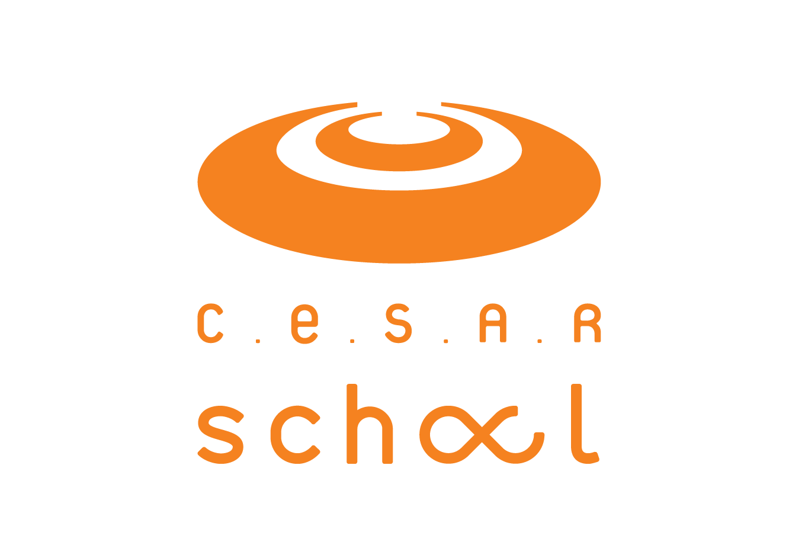

# vrum
Verificação de Risco e Uso de Motores

> **Acelerando decisões seguras através da reconstrução cronológica da vida do chassi.**

[]()
[]()
[]()

---

<table style="display: none;">
  <tr>
    <td align="center">
      <h3>🎓 Instituição Executora</h3>
      
    </td>
    <td align="center">
      <h3>🤝 Parceiro</h3>
      
    </td>
  </tr>
</table>

**Curso:** Residência Tecnológica em Análise de Dados e IA — 2026

</div>

### 👥 Participantes

| Participante | GitHub |
|---|---|
| **Aldine Correia** | [github.com/aldinecorreia](https://github.com/aldinecorreia) |
| **Anderson Paixão** | [github.com/andpax](https://github.com/andpax) |
| **Katherine Lacerda** | [github.com/kathlacerda](https://github.com/kathlacerda) |
| **Laura Mendes Marinho** | [gituub.com/alaruma](https://github.com/alaruma) |
| **Nayara Ramos** | [github.com/nay-ramos](https://github.com/nay-ramos) |
| **Yuri Henrique** | [github.com/yuridevnba](https://github.com/yuridevnba) |

---

## 📌 Sobre o projeto
Analisar dados históricos para interpretar a história da propriedade de veículos financiados em busca de padrões de negociação, por meio do CHASSI do veículo, para identificar possíveis tentativas de fraude em uma transação. Para isso, transformamos a linha do tempo bruta de propriedade de cada chassi em indicadores explicáveis.

## Quais os desafios?
### **Aprovar rápido** para não prejudicar a conversão e a experiência do cliente.

- Grupos criminosos se aproveitam do interesse em rápida aprovação das financiadoras para passarem **dados falsos de compradores com bom score.**
- Algumas fraudes podem incluir uma rápida troca de posse do veículo, o que gera muitos contratos para analisar e pode deixar o processo lento e criar um **desafio entre segurança e velocidade de aprovação.**
- A falta de critérios refinados **pode gerar falsos positivos**, que é o pior cenário para esse tipo de análise.

### **Manter a segurança** para não financiar um ativo com histórico de propriedade manipulado.

- Evitar falsos positivos a todo custo para evitar impacto financeiro, judicial e de imagem da financiadora no mercado.

### **Operar com eficiência** para não sobrecarregar mesas de análise manual.

- Sobrecarregar a análise manual significa perda financeira em 2 vieses: aprovação lenta (potencialmente perder clientes) e muito tempo dedicado a análises complexas e morosas caso a caso (gasto com salário dos funcionários).

## Qual o ponto de partida?
Transferências sucessivas de chassi podem antecipar o financiamento e dificultar a recuperação do ativo em caso de inadimplência ou fraude. O risco potencial está na combinação de **velocidade**, **sequência**, **permanência**, **tipo de proprietário** e **histórico financeiro** — e dificilmente aparece de forma explícita em um único evento isolado:

| FENÔMENO | COMO SE MANIFESTA |
|---|---|
| Passagens rápidas em cadeia | Múltiplas transferências de propriedade em janelas de 7, 15, 30 ou 90 dias |
| Baixa permanência | Tempo de posse muito curto entre uma transferência e a seguinte, atual ou anterior |
| Sequência PF/PJ atípica | Alternância suspeita entre pessoa física e jurídica na cadeia de propriedade |
| CNAE incompatível | Proprietário PJ com atividade econômica (CNAE) sem relação plausível com veículos |
| Padrão de aquisição | Combinação recorrente de compra à vista seguida de rápida revenda financiada |
| Intervalos anômalos | Tempo entre passagens sucessivas muito menor que o observado em transferências legítimas |

## Qual o escopo técnico?
### **Análise Exploratória e Engenharia de Variáveis**

- Reconstruir a linha do tempo completa de propriedade por chassi
- Investigar padrões temporais: transferências em 7, 15, 30 e 90 dias
- Criar variáveis de permanência (atual e anterior), média e mediana do tempo de posse
- Mapear sequências de tipo de proprietário (PF/PJ) e CNAE associado
- Identificar diferenças de comportamento entre cadeias de propriedade suspeitas e legítimas

| CATEGORIA | VARIÁVEL | RELEVÂNCIA |
|---|---|---|
| Temporal | Timestamps das transferências por chassi | Janelas de 7, 15, 30 e 90 dias |
| Comportamental | Nº de transferências por janela | Feature central de velocidade de troca |
| Permanência | Tempo de posse atual e anterior (média/mediana) | Indicador de baixa permanência |
| Perfil | Tipo de proprietário na sequência (PF/PJ) | Identifica alternâncias atípicas |
| Contexto | CNAE do proprietário PJ | Compatibilidade da atividade com o ativo |
| Financeiro | Modalidade de aquisição (à vista ou financiado) | Padrão de aquisição e revenda |
| Intervalo | Tempo entre passagens sucessivas | Detecta cadeias aceleradas |
| Target | Marcação de evento em janela de 90 dias | Variável resposta para modelagem |

### **Modelagem e Avaliação Técnica**

- Definir o target mais adequado ao problema, com janela de performance de 90 dias
- Aplicar split temporal para evitar vazamento de informação (leakage)
- Treinar modelo supervisionado (logit, árvore, boosting) ou motor de regras
- Avaliar com métricas técnicas: AUC, KS, Precision, Recall e PR-AUC
- Comparar abordagem de score puro vs. score + indicadores híbridos

### **Política operacional**

- Zonas de decisão APROVAR / INVESTIGAR / BLOQUEAR com limites calibrados só no treino
- Flags explicáveis para priorização da mesa de análise (ver `docs/flags_para_mesa.txt`)
- Estabilidade por safra e por instituição financeira (drift)

## Pipeline (ordem de execução)

```
docs/*.csv  →  src/montagem_inicial.py  →  src/modelo_xgboost.py  →  src/politica_operacional_vrum.py  →  src/flags_mesa.py
              (timeline + features)       (split 30d + XGBoost)      (zonas + estabilidade)              (dataset p/ dashboard)
```

Scripts de apoio (fora do pipeline principal):
- `src/ordenacao_cronologica_chassi.py` — entregável de ordenação cronológica canônica (timeline long + JSON por chassi + sumário)
- `src/pipeline_eventos.py` — EDA de sanidade das bases
- `src/vrum_split_temporal.py` — split temporal demonstrativo com dados simulados
- `src/vrum_decision_engine.py` — motor de flags/zona em pandas (contrato de entrada na docstring)
- `src/comparativo_arvore_flags.py` — experimento: árvore de decisão sobre as flags vs. score (conclusão: sem ganho nesta base)
- `src/comparativo_modelos.py` — benchmark de 6 modelos (Dummy a XGBoost) na mesma base/split (conclusão: algoritmo irrelevante nesta base)

Manual completo de uso: [`docs/manual_uso_vrum.md`](docs/manual_uso_vrum.md).

## Instalação e execução

```bash
conda create -n vrum python=3.12 -y
conda run -n vrum pip install -r requirements.txt

# 1. Timeline + features (gera output/vrum_timeline_completa.csv)
python src/montagem_inicial.py

# 2. Modelo (gera output/modelo_xgboost_vrum.json + métricas)
python src/modelo_xgboost.py

# 3. Política operacional (gera output/politica_zonas_vrum.csv)
python src/politica_operacional_vrum.py

# 4. Flags para a mesa (gera output/vrum_propostas_flags.csv — base do dashboard)
python src/flags_mesa.py

# Dashboard da mesa de análise (Streamlit, porta 8523)
streamlit run dashboard/app.py --server.port 8523

# Testes
python -m unittest discover -s tests
```

Dados brutos (5 CSVs, ~400MB) ficam em `docs/` e não são commitados (ver `.gitignore`).

### Dashboard da mesa de análise

- `dashboard/app.py` (Streamlit): fila operacional priorizada, evidências por proposta,
  timeline do chassi, panorama de sinais/score/exposição
- Design documentado em `docs/design_mesa_vrum.md`

## Trabalho futuro

- **Camada LLM/RAG** (LangChain, ChromaDB, sentence-transformers): consulta conversacional da linha do tempo de um chassi para a mesa de análise. Ainda não implementada; arquitetura prevista como camada de leitura sobre os artefatos de `output/`.
- Registro da decisão do analista (fechar o loop de avaliação da mesa)
- Recalibração com dados reais e target maturado
